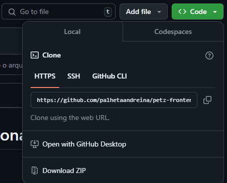
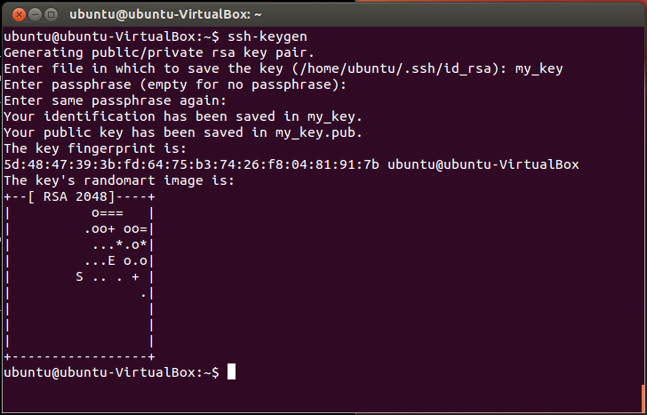

# Comandos Git

Quando fazer o `git clone`:

- Não tiver o repositório na maquina local

Como escolher entre HTTPS e SSH



HTTPS

- Quando não tiver a chave ssh na maquina local
- pra autenticar ele vai pedir usuário e senha

SSH

- chave de autenticação
- tem que ta maquina local e na conta git
- comando pra criar uma nova chave `ssh-keygen`



# Como versionar e trabalhar com git

Como nomear um repositorio

- sem acentuação gráfica
- utilizar letras minúsculas
- separar palavaras por traços
- nome do time - nome do projeto notifications-consumidor-eventos

## Subindo arquivos locais para um repo novo:

```sh
# escreve dentro de README.md o texto "# petz-frontend"
echo "# petz-frontend" >> README.md
# inicializa o git na pasta
git init
# salva as alterações feitas no arquivo
# https://www.freecodecamp.org/news/content/images/2023/02/image-180.png
git add README.md
# Agrupa as alterações do arquivo
# -m: mensagem que descreva o que foi modificado
git commit -m "first commit"
# -M renomear o nome da branch, sem o -m cria uma nova branch
git branch -M main
# o caminho do repositório que os arquivos serão enviados
git remote add origin https://github.com/palhetaandreina/petz-frontend.git
# manda os arquivos comitados local para o repositorio remoto
git push -u origin main
# Se não tiver a branch no repositório remoto, usar esse comando para add
git push --set-upstream origin 'nome-da-branch'
```

## Conceitos

### Status

Exibir o status do repositório, quais arquivos foram modificados, comitados.

### Stage

Arquivos que foram adicionados mas não comitados.

### Commit

Modificações de arquivos que foram agrupados seguido de uma mensagem.

### Branchs

Ramificações que surgem a partir da necessidade de criações ou modificações que nãom prejudiquem a branch anterior.

Trabalhar em branchs diferentes dos outros pra evitar conflitos.

### Pull/Push

Push - Manda as alterações comitadas para o repositório remoto.

Pull - Baixa as alterações do repositório remoto.

### Merge

Mesclar alterações de uma branch para outra branch

### Pull Requests (ou Merge request para gitlab)

Requisição de pull, de alterações por meio de reviews de outros membros do time.

Pra solicitar o pull request: descrição, título, base(branch que vai receber os commits), marcar os reviewers, etc.

Pra fazer review do pull request: adicionar comentários, solicitar alterações, aprovar ou reprovar.
